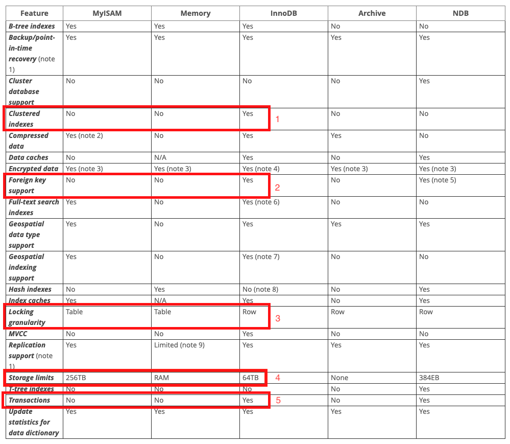

# Environment
* MySQL 8.0

# InnoDB vs MyISAM

1. Clustered indexes 
Clustered index : https://dev.mysql.com/doc/refman/8.0/en/glossary.html#glos_clustered_index 
Join performance : https://www.percona.com/blog/2006/05/29/join-performance-of-myisam-and-innodb/ 
5. Transactions 
Commit and Rollback for MyISAM : https://stackoverflow.com/questions/8036005/myisam-engine-transaction-support

# Choosing a storage engine
https://dev.mysql.com/doc/refman/8.0/en/storage-engines.html
###### * 참조
1. InnoDB : It is an engine that performs well and offers many of required attributes that any database would need
2. MyISAM : Read-heavy application

# Reference
* https://dev.mysql.com/doc/refman/8.0/en/storage-engines.html
