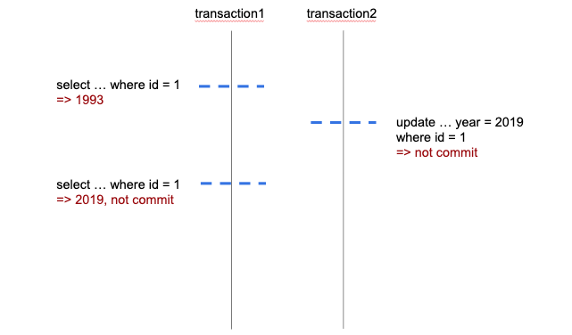
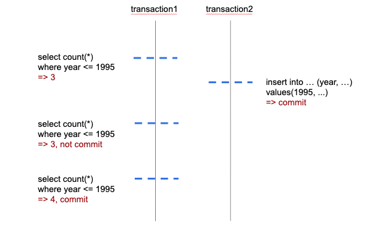

# Overview
About isolation level

# Isolation level
* Read Uncommitted
* Read Committed
* Repaeatable Read => MySQL default
* Serializable

# Dirty Rread
 

# Phantom Read
 

# Reference
* https://medium.com/@huynhquangthao/mysql-testing-isolation-levels-650a0d0fae75
* https://en.wikipedia.org/wiki/Isolation_(database_systems)
