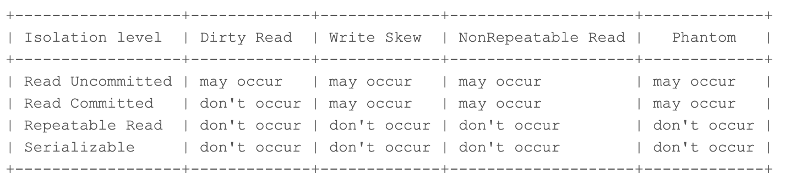

# Overview
About isolation level

# Isolation level
* Read Uncommitted
* Read Committed
* Repaeatable Read => MySQL default
* Serializable
 

# Reference
* https://medium.com/@huynhquangthao/mysql-testing-isolation-levels-650a0d0fae75
