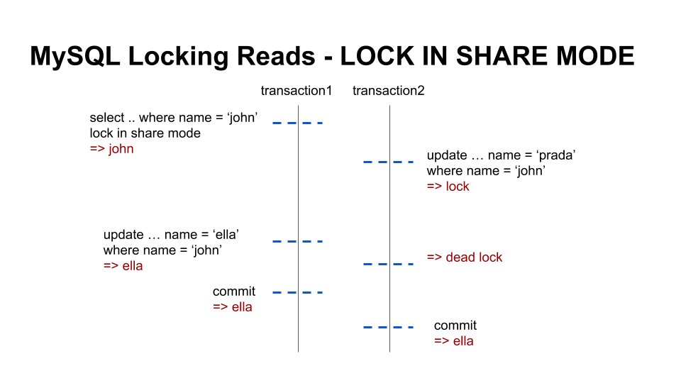

# Overview
Locking Reads
LOCK IN SHARE MODE vs FOR UPDATE

# Environments
* MySQL 5.7

# LOCK IN SHARE MODE
Sets a shared mode lock on any rows that are read. Other sessions can read the rows, but cannot modify them until your transaction commits. If any of these rows were changed by another transaction that has not yet committed, your query waits until that transaction ends and then uses the latest values 
 
 
 

# FOR UPDATE
For index records the search encounters, locks the rows and any associated index entries, the same as if you issued an UPDATEstatement for those rows. Other transactions are blocked from updating those rows, from doing SELECT ... LOCK IN SHARE MODE, or from reading the data in certain transaction isolation levels. Consistent reads ignore any locks set on the records that exist in the read view 
 

# Reference
* https://dev.mysql.com/doc/refman/5.7/en/innodb-locking-reads.html
* https://idea-sketch.tistory.com/47
* https://suhwan.dev/2019/06/09/transaction-isolation-level-and-lock/
